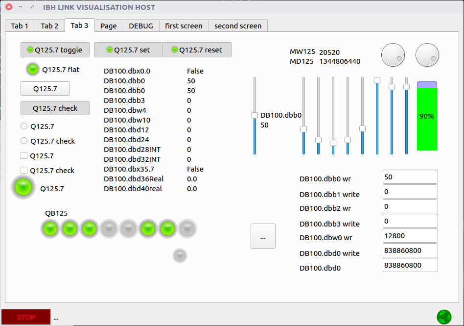
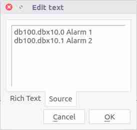

# Visualization app writen in python for IBH Link S7++
Project is port to python and develop of some example applications, provided by "IBHsoftec GmbH" with drivers for this gateway.
For details of "Ibh link" API look in [IBH Link S7++](https://www.ibhsoftec.com/IBH-Link-S7-PP-Eng) download section.

## What is PLC, HMI, Memory areas
### PLC
Programmable logic controllers are workhorse of industrial automation, they setting states on outputs depending
on input states and inner program logic. Inputs are driven by: various type of sensors, buttons, potentiometers.
Outputs drive indirect actuators: motors, servos, valves, grippers, lights, etc.
In majority the main loop inside runs every few milliseconds, which determine shortest response time.

[PLC in wikipedia](https://en.wikipedia.org/wiki/Programmable_logic_controller)
## HMI
Human machine interface is device which allows to interact operator with PLC(Machine), generally it is touch screen display
with micro embedded PC and operating system.
The main goal is to replace control panels with many manual buttons, switches and lamps, to compact size more expressive device.
HMI is equipped in some kind of communication interface to exchange data with PLC.

[HMI in wikipedia](https://en.wikipedia.org/wiki/Control_panel_(engineering))
## Memory areas
We distinguish following memory areas:
I - Input area, is writen by PLC every main loop iteration. It reflects state or analog values of sensors.
Q - Output area, usually is writen after main loop ends. By setting logical true state on output PLC can turn on motor for instance.
M - Memory/marker, is area in PLC memory where can be stored intermediate or temporary states of operation.
DB - Data block area, is structure defined area by user in programming stage. Usually persistent.
T - Timer area, is PLC set of timers.
C - Counter area, is PLC set of counters.
## Content of repository
Repository contains modules for handling as client and server, the base api modules are writen in standard Python 3.
Thereby base api modules can be used separately without GUI, or different GUI framework can be used.
Base api modules are: ibh_client.py, ibh_server.py, ibh_const.py, data_plc.py, ibh_server_data.py.
The managing classes, these invoking api are writen in PyQt5: ibh_client_qt_adapter.py, ibh_server_qt_adapter.py,
ibh_server_model.py
# Examples in repository
## GUI SERVER

Designed for testing client applications.

Features:
* Single thread
* Using model-view architecture

File: server_gui_example.py

## GUI CLIENT

Can execute single operations.

Features:
* Single thread
## VISUALISATION HOST

Designed to be substitute of simple HMI.
Main feature is that application at start up loads screens/widgets '.ui' files created in QtCreator, and adding them
to tab widget. To add visualisation screen modify 'config.ini' \[SCREENS\] property.
In screen/widget '.ui' file to add gui element read/write action with PLC variable, simply fill "whatsThis" property.
Supported widgets for read and modifying variables are: QPushButton, QLabel, QSlider, QDial, QProgressBar, QLineEdit.
For displaying alarms should be used QListView, just edit "What's this" property like in picture below.

### What's this property

Valid entry in "whatsThis" are:
variable absolute address\[interpretation of bytes\]\[action\]\[range of variation\].
Entries are case insensitive, you can use german notation A==Q, E==I.
* absolute address - must be applied, examples: I10.0, MW20, DB100.DBX1.0, ... .
* interpretation of bytes - can be: BOOL, BYTE, SINT, WORD, INT, DWORD, DINT, REAL. If not specified, default types are:
 \[I,Q,M,D\]B is BYTE, \[I,Q,M,D\]W is WORD, \[I,Q,M,D\]D is DWORD.
* action - is type of action to apply after click, drag or move element. If not specified default is READ.
Entering of READ is faulty, if you want read action just do not specify any action.
Actions for multi-bytes types can only be WRITE, for BOOL type can be: SETS or S, RESET or R, TOGGLE or T.
* range of variation - is the range of allowed entries by user it refers mainly to QLineEdit. If not specified, maximal
and minimal "interpretation of bytes" type will be used. Example: "range(-1.0,1.0)".

### DEBUG tab
If in "config.ini" \[DBEUG\] console=True, then DEBUG tab will be shown. It is helpful in screen/widget debugging because
there is logged parsing of "whatsThis" properties, and adding actions to GUI elements.
